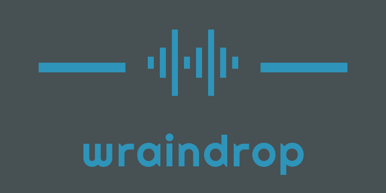

[](https://github.com/wraikny/WraindropBot/actions?workflow=CI)
# Wraindrop bot



よくあるDiscordの読み上げbotです。
WindowsとRaspberry Pi (Raspbian)で動作します。

* [使い方ドキュメント](/doc/usage.md)
* [開発用ドキュメント](/doc/dev.md)
* [Discord botの設定](/doc/bot_settings.md)

## 環境
* .NET6 （開発環境）
* ffmpeg
* libsodium and Opus（Raspberry Pi）
* AquesTalk (Raspberry Pi)

## RaspberryPiでAquesTalk Piをインストールする

AquestTalk Pi は個人の非営利でのみ無償で使用できます。  
それ以外の場合はライセンスを購入する必要があります。

```sh
cd /home/pi
wget https://www.a-quest.com/archive/package/aquestalkpi-20201010.tgz
zcat aquestalkpi-20201010.tgz | tar xv
rm aquestalkpi-20201010.tgz
chmod +x aquestalkpi/AquesTalkPi
```

# Reference
* [DSharpPlus](https://dsharpplus.github.io/)
* [Google Cloud TTSとDSharpPlusを使って代読DiscordボットをF#で作る](https://anqou.net/teqblog/2020/12/make-tts-discord-bot-in-fstar-using-google-cloud-tts-and-dsharp-plus/)
